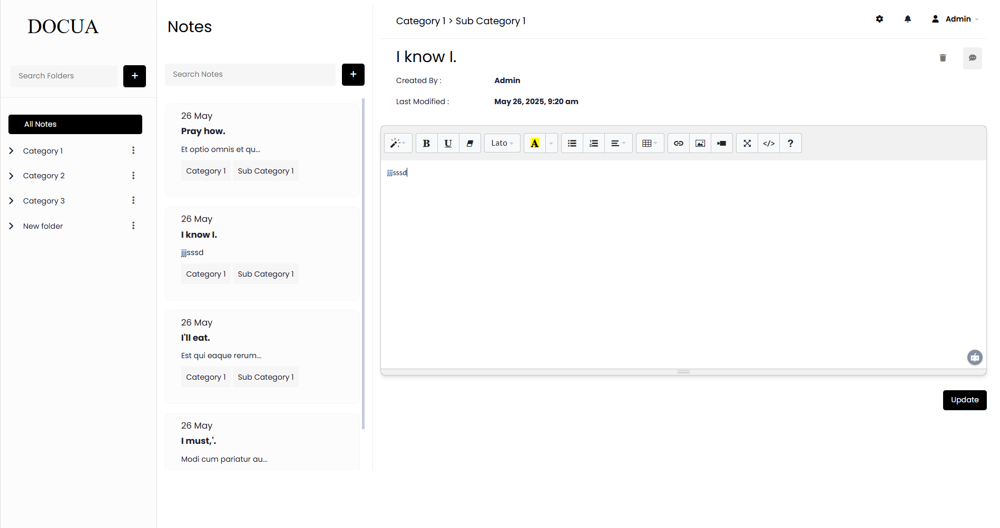

  <h1>📝 Laravel Notes Mangement Project</h1>

  
A full-featured Notes Management System (CMS) built with <strong>Laravel</strong>. This CMS allows administrators to manage pages, posts, users, categories, and more, all from a clean and responsive dashboard interface.

  <h2>⚙️ Features</h2>
  <ul>
    <li>User Authentication & Role Management</li>
    <li>Rich Text Editor (CKEditor) for content creation</li>
    <li>Post management with categories and tags</li>
    <li>Dynamic page creation and SEO support</li>
    <li>RESTful routing and clean MVC structure</li>
  </ul>

  <h2>📸 Screenshots</h2>

  <h3>Dashboard</h3>
  

  <h2>📦 Tech Stack</h2>
  <ul>
    <li>Laravel 10+</li>
    <li>Blade Templating</li>
    <li>MySQL / SQLite</li>
    <li>Bootstrap 5</li>
    <li>JavaScript (Vanilla / Alpine.js)</li>
  </ul>

  <h2>🚀 Installation</h2>
  <ol>
    <li>Clone the repository:
      <pre><code>git clone https://github.com/wafafatima66/CMS</code></pre>
    </li>
    <li>Navigate to the project directory:
      <pre><code>cd laravel-cms</code></pre>
    </li>
    <li>Install dependencies:
      <pre><code>composer install
npm install && npm run dev</code></pre>
    </li>
    <li>Copy the example environment file and configure:
      <pre><code>cp .env.example .env</code></pre>
    </li>
    <li>Generate the application key:
      <pre><code>php artisan key:generate</code></pre>
    </li>
    <li>Set up your database in <code>.env</code>, then run migrations:
      <pre><code>php artisan migrate --seed</code></pre>
    </li>
    <li>Run the local development server:
      <pre><code>php artisan serve</code></pre>
    </li>
    <li>Access it at: <code>http://localhost:8000</code></li>
  </ol>

  <h2>👤 Default Admin Login</h2>
  <pre><code>Email: admin@example.com
Password: 123456</code></pre>

  <h2>📬 Contact</h2>

If you want to get in touch, feel free to connect via <a href="https://www.linkedin.com/in/fatimaamir99/" target="_blank">LinkedIn</a>

  <h3>⭐ Star the repo to support this project!</h3>

</body>
</html>
